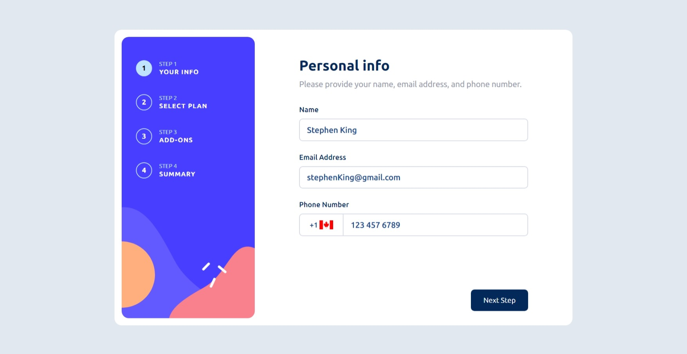

# Frontend Mentor - Multi Step form component solution 📄

This is a solution to the [Multi Step form component challenge on Frontend Mentor](https://www.frontendmentor.io/challenges/multistep-form-YVAnSdqQBJ).

The component was made in a way to let the devs add unlimited amount of Forms via props, this components works as a container or visual layout for Forms Components, the logic and the validations are made in the Forms components themselves. 

In order to work with this component, the Form must have a HTML form. so once the user press the Button, the Multi-step-form components submits the current Form's form, and therefore, execute the logic of the Form submit handler, there you can any kind of logic that is executed when the Next Step button is clicked like error messages if a field is wrong.

## Table of contents

- [Overview](#overview)
  - [The challenge](#the-challenge)
  - [Screenshot](#screenshot)
  - [Links](#links)
- [My process](#my-process)
  - [Built with](#built-with)
  - [What I learned](#what-i-learned)
  - [Continued development](#continued-development)
  - [Useful resources](#useful-resources)
- [Author](#author)

## Overview

### The challenge

Users should be able to:

🆗 - View the optimal layout for the interface for mobile and desktop screens.
🆗 - Complete each step of the sequence
🆗 - Go back to a previous step to update their selections
🆗 - See a summary of their selections on the final step and confirm their order
🆗 - See hover and focus states for all interactive elements on the page
🆗 - See Form transition animations
🆗 - Receive form validation messages if a field is wrong or missing
🆗 - Select their country code from a modal list for phone numbers

### Screenshot

### Links

- Live Site URL: [Add live site URL here](https://nextjs-tailwind-refer59.vercel.app/multi-step-form)

## My process

### Built with

- HTML Semantic
- Flexbox
- Mobile-first workflow
- [React](https://reactjs.org/) - JS library
- [Next.js](https://nextjs.org/) - React framework
- [TailwindCSS](https://tailwindcss.com//) - For styles
- [Rest Countries API](https://restcountries.com/) - For the countries flags

**Note: These are just examples. Delete this note and replace the list above with your own choices**

### What I learned

✅ Improved coding validations
✅ Animations handling with JS
✅ Better layout methodology

### Continued development

🔸 I want to continue using Tailwind and Next.js to master them both
🔸 Improve my code readability
🔸 Learn how to do Performance testing to ensure when to use react optimizacion hooks like useCallback and useMemo.

## Author

- Frontend Mentor - [@Refer59](https://www.frontendmentor.io/profile/Refer59)

